# Compiler Architecture

This project compiles a statically typed, expression-oriented subset of Racket
to x86-64 assembly. It follows the incremental-language approach in
*Essentials of Compilation*: each compiler pass transforms one explicit AST
into the next representation instead of directly translating source code to
machine instructions.

## Entry points

There are two ways to use the compiler.

- `make test` builds `runtime.o` and runs `run-tests.rkt`. The test harness
  checks source programs against intermediate-language interpreters and, for
  final cases, assembles and executes native x86-64 programs.
- `racket compile.rkt program.rkt` is the user-facing compiler command. It
  reads one source program, type-checks it, runs the active pipeline, and
  writes a `.s` assembly file. `make build PROGRAM=program.rkt` then links
  that assembly with `runtime.o` to produce an executable.

`compile.rkt` is a driver around the compiler; the compiler transformations
themselves are defined in `compiler.rkt`.

## Overall flow

```mermaid
flowchart LR
    A[Typed Racket source] --> B[Normalized function AST]
    B --> C[Explicit allocation and atomic operands]
    C --> D[Control-flow graph]
    D --> E[Pseudo x86-64]
    E --> F[Liveness and interference graph]
    F --> G[Register-allocated x86-64]
    G --> H[Patched instructions and stack frames]
    H --> I[x86-64 assembly]
    I --> J[Executable linked with runtime.c]
```



The active pass registry is at the bottom of `compiler.rkt`. The supplied
interpreters can execute most intermediate representations, so the test suite
can check that a pass preserves the source program's result before continuing
to the next pass.

## Pipeline

| Stage | Pass | Main responsibility |
| --- | --- | --- |
| 1 | `shrink` | Lowers `and`/`or` to conditionals and puts the top-level expression in synthetic `main`. |
| 2 | `uniquify` | Alpha-renames bindings so every variable has a unique identity. |
| 3 | `reveal-functions` | Makes top-level function values explicit references with arity information. |
| 4 | `limit-functions` | Keeps calls within the six-register System V convention by packing source arguments after the fifth into a typed vector passed as argument six. |
| 5 | `expose-allocation` | Rewrites vector literals into evaluation, heap-space checks, collection when needed, allocation, and field writes. |
| 6 | `uncover-get!` | Marks reads of mutated variables so normalization preserves evaluation order. |
| 7 | `remove-complex-operands` | Names non-atomic subexpressions with temporaries until operations, calls, and comparisons use atomic operands. |
| 8 | `explicate-control` | Converts expression structure into basic blocks, assignments, effects, branches, calls, returns, and tail calls. |
| 9 | `select-instructions` | Converts the control-flow IR into a pseudo-x86 AST. |
| 10 | `uncover-live` | Computes backward liveness for each block and instruction. |
| 11 | `build-interference` | Builds the graph of locations that cannot share a register or stack home. |
| 12 | `allocate-registers` | Uses DSATUR graph coloring to choose registers and stack/root-stack spill slots. |
| 13 | `patch-instructions` | Rewrites x86 forms that cannot be encoded directly, using scratch registers where needed. |
| 14 | `prelude-and-conclusion` | Creates function entry/exit code, stack frames, root-stack setup, and the final `main`/`conclusion` blocks. |

## Source language and lowering choices

The implemented language includes 64-bit integers, Booleans, `void`, lexical
variables, conditionals, mutation, loops, typed heterogeneous vectors, typed
top-level functions, recursion, function references, indirect calls, and tail
calls. It is not full Racket: general lambdas, closure conversion, strings,
floating point, modules, macros, exceptions, multiplication, and division are
not in the active pipeline.

Function values are raw code addresses, not heap-allocated closures. This is
why a function reference may be stored in a vector but is not marked as a GC
pointer in that vector's header.

## Control flow and calls

`explicate-control` translates one source expression differently depending on
whether its value is needed in a tail, assignment, predicate, or effect
position. This preserves the order of `set!`, `while`, `begin`, conditionals,
and calls.

The compiler follows the System V x86-64 integer calling convention. The first
six machine arguments use `%rdi`, `%rsi`, `%rdx`, `%rcx`, `%r8`, and `%r9`.
Because this compiler reserves the sixth position for an overflow-argument
vector, a source function may receive five ordinary register arguments; source
arguments six and later are packed into that vector. Direct calls name an
assembler label, while calls through a function value use indirect `callq`.
Tail calls restore the current frame and jump to the callee instead of making a
new call frame.

User-defined function labels are prefixed with `rkt_`. Punctuation and
underscores are encoded by character code, making distinct Racket identifiers
such as `foo-bar` and `foo_bar` distinct assembler labels and avoiding runtime
symbol collisions.

## Pseudo-x86, liveness, and allocation

Instruction selection produces an x86 AST before registers are assigned.
Variables at this stage are pseudo-registers. Liveness walks each basic block
backward using instruction read/write sets. At a call, argument registers are
read and caller-saved registers are treated as clobbered.

The interference pass adds an edge between values that are live at the same
time. For moves, it avoids the unnecessary source/destination edge when safe,
which lets coloring eliminate some copies. Register allocation uses a
priority-queue DSATUR strategy across eleven allocatable general-purpose
registers.

Values that do not receive a register are spilled. Ordinary values use
frame-pointer-relative stack slots. Vector values that are live across a call
or collection use slots relative to `%r15`, the root-stack pointer. The runtime
can therefore find and update them if copying collection moves their objects.

## Vectors, heap layout, and garbage collection

A vector is a heap object containing one header word followed by one 64-bit
word per element. The header tag is constructed at compile time:

```text
bit 0       1 while the object has not been forwarded
bits 1–6    vector length
bits 7+     one bit per field: 1 when that field is a heap pointer
```

Only vectors are collector-managed heap pointers in the current language.
Integers, Booleans, `void`, and raw function addresses are not traced.

Before allocating, generated code compares the requested bytes against
`free_ptr` and `fromspace_end`. If space is insufficient, it calls `collect`
with the current root-stack pointer. The C runtime implements Cheney
semispace-copying collection and updates the roots that the compiler placed on
the root stack.

## Source modules in `compiler/`

`compiler.rkt` remains the home of the pass implementations. The smaller
`compiler/` source directory holds shared concerns that are required by it:

| Module | Used for |
| --- | --- |
| `compiler/abi.rkt` | System V argument/caller-saved/callee-saved register sets, allocator register list, and register-color mapping. |
| `compiler/dataflow.rkt` | Generic work-list fixed-point analysis used by liveness. |
| `compiler/heap-layout.rkt` | Vector tag construction and the definition of a GC pointer type. |
| `compiler/labels.rkt` | Collision-safe mapping from Racket function symbols to assembler labels. |

The nested `compiler/compiled/` directory is different: Racket creates it
automatically as a local bytecode cache (`.zo` and `.dep` files). It is not
source code, is not required directly by `compiler.rkt`, can be deleted safely,
and is ignored by Git.

## Platform boundary

The emitted assembly targets x86-64. On Apple Silicon, the Makefile builds
`runtime.c` for x86-64 as well, so it can be linked with generated assembly;
Rosetta 2 is needed to execute the resulting binary. On Linux, the Makefile
adds `-z noexecstack` when linking generated programs.
